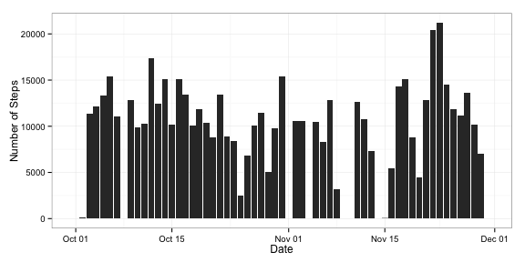
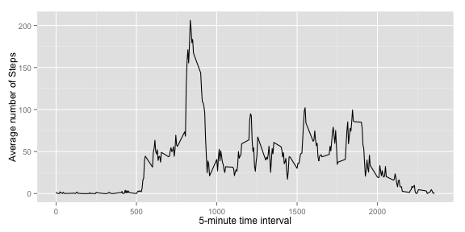
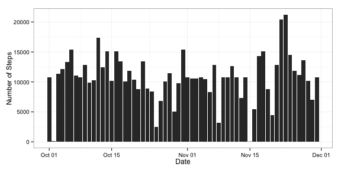
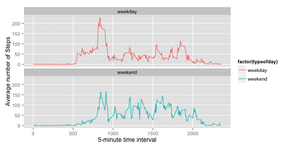

In this report, we're making use of data from a personal activity monitoring device. The device collects data at 5 minute intervals throughout the day. The data consists of two months of data from an anonymous individual collected during the months of October and November, 2012 and includes the number of steps taken in 5 minute intervals each day.

The variables included in the dataset are:
- **steps** - Number of steps taken in a 5-minute interval (missing values are coded as NA)
- **date** - The date on which the measurement was taken in YYYY-MM-DD format
- **interval** - Identifier for the 5-minute interval in which measurement was taken

### Section 1 - Loading and preprocessing the data

First we're reading the dataset, and converting the **date** variable (which is by default read as factor) to Date:


```r
amdata <- read.csv(unz("activity.zip", "activity.csv"))
amdata$date <- as.Date(amdata$date, format = "%Y-%m-%d")
```

There're 17568 records in the dataset.

### Section 2 - What is mean total number of steps taken per day?

We're summarizing the input dataset to calculate [sum][sumref], [mean][meanref] and [median][medianref] of **steps** for each **date**. We're ignoring the missing (NA) values for these calculations.


```r
library(plyr)
amsummdata <- ddply(amdata, .(date), summarize, sum=sum(steps, na.rm=TRUE), mean=mean(steps, na.rm=TRUE), median=median(steps, na.rm=TRUE))
```

There're 61 records in the summarized dataset. If there're only NA steps for a day, the sum is calculated as 0, mean as [NaN][nanref], and median as NA. 
We're using the summarized dataset to create below histogram plot, depicting total number of steps taken during each day:


```r
library(ggplot2)
ggplot(amsummdata, aes(x=date,y=sum)) + geom_bar(stat="identity") + xlab("Date")  + ylab("Number of Steps") + theme_bw()
```

 

We're now using the summarized dataset to show the **sum**, **mean** and **median** total number of steps taken per day:


```r
library(knitr)
kable(amsummdata[,c("date","sum","mean","median")], align=c("c","c","c","c"))
```


|    date    |  sum  |  mean   | median |
|:----------:|:-----:|:-------:|:------:|
| 2012-10-01 |   0   |   NaN   |   NA   |
| 2012-10-02 |  126  | 0.4375  |   0    |
| 2012-10-03 | 11352 | 39.4167 |   0    |
| 2012-10-04 | 12116 | 42.0694 |   0    |
| 2012-10-05 | 13294 | 46.1597 |   0    |
| 2012-10-06 | 15420 | 53.5417 |   0    |
| 2012-10-07 | 11015 | 38.2465 |   0    |
| 2012-10-08 |   0   |   NaN   |   NA   |
| 2012-10-09 | 12811 | 44.4826 |   0    |
| 2012-10-10 | 9900  | 34.3750 |   0    |
| 2012-10-11 | 10304 | 35.7778 |   0    |
| 2012-10-12 | 17382 | 60.3542 |   0    |
| 2012-10-13 | 12426 | 43.1458 |   0    |
| 2012-10-14 | 15098 | 52.4236 |   0    |
| 2012-10-15 | 10139 | 35.2049 |   0    |
| 2012-10-16 | 15084 | 52.3750 |   0    |
| 2012-10-17 | 13452 | 46.7083 |   0    |
| 2012-10-18 | 10056 | 34.9167 |   0    |
| 2012-10-19 | 11829 | 41.0729 |   0    |
| 2012-10-20 | 10395 | 36.0938 |   0    |
| 2012-10-21 | 8821  | 30.6285 |   0    |
| 2012-10-22 | 13460 | 46.7361 |   0    |
| 2012-10-23 | 8918  | 30.9653 |   0    |
| 2012-10-24 | 8355  | 29.0104 |   0    |
| 2012-10-25 | 2492  | 8.6528  |   0    |
| 2012-10-26 | 6778  | 23.5347 |   0    |
| 2012-10-27 | 10119 | 35.1354 |   0    |
| 2012-10-28 | 11458 | 39.7847 |   0    |
| 2012-10-29 | 5018  | 17.4236 |   0    |
| 2012-10-30 | 9819  | 34.0938 |   0    |
| 2012-10-31 | 15414 | 53.5208 |   0    |
| 2012-11-01 |   0   |   NaN   |   NA   |
| 2012-11-02 | 10600 | 36.8056 |   0    |
| 2012-11-03 | 10571 | 36.7049 |   0    |
| 2012-11-04 |   0   |   NaN   |   NA   |
| 2012-11-05 | 10439 | 36.2465 |   0    |
| 2012-11-06 | 8334  | 28.9375 |   0    |
| 2012-11-07 | 12883 | 44.7326 |   0    |
| 2012-11-08 | 3219  | 11.1771 |   0    |
| 2012-11-09 |   0   |   NaN   |   NA   |
| 2012-11-10 |   0   |   NaN   |   NA   |
| 2012-11-11 | 12608 | 43.7778 |   0    |
| 2012-11-12 | 10765 | 37.3785 |   0    |
| 2012-11-13 | 7336  | 25.4722 |   0    |
| 2012-11-14 |   0   |   NaN   |   NA   |
| 2012-11-15 |  41   | 0.1424  |   0    |
| 2012-11-16 | 5441  | 18.8924 |   0    |
| 2012-11-17 | 14339 | 49.7882 |   0    |
| 2012-11-18 | 15110 | 52.4653 |   0    |
| 2012-11-19 | 8841  | 30.6979 |   0    |
| 2012-11-20 | 4472  | 15.5278 |   0    |
| 2012-11-21 | 12787 | 44.3993 |   0    |
| 2012-11-22 | 20427 | 70.9271 |   0    |
| 2012-11-23 | 21194 | 73.5903 |   0    |
| 2012-11-24 | 14478 | 50.2708 |   0    |
| 2012-11-25 | 11834 | 41.0903 |   0    |
| 2012-11-26 | 11162 | 38.7569 |   0    |
| 2012-11-27 | 13646 | 47.3819 |   0    |
| 2012-11-28 | 10183 | 35.3576 |   0    |
| 2012-11-29 | 7047  | 24.4688 |   0    |
| 2012-11-30 |   0   |   NaN   |   NA   |

### Section 3 - What is the average daily activity pattern?

We're now summarizing the input dataset to calculate **average** number of **steps** for each **interval**, averaged across all days. We're again ignoring the missing (NA) values for these calculations.


```r
library(plyr)
amintsummdata <- ddply(amdata, .(interval), summarize, avg=mean(steps, na.rm=TRUE))
```

There're 288 records in this new summarized dataset. We're now using this new summarized dataset to create below time-series plot, depicting average number of steps by each 5-minute time interval:


```r
library(ggplot2)
ggplot(amintsummdata, aes(x=interval,y=avg)) + geom_line() + xlab("5-minute time interval")  + ylab("Average number of Steps")
```

 

Calculate maximum average and corresponding time-interval:


```r
maxavgsteps <- max(amintsummdata$avg)
maxavgts <- amintsummdata[which.max(amintsummdata$avg), 1]
```

The **time-interval 835** contains the maximum number of steps on average across all days in the dataset - **206.1698**.

### Section 4 - Imputing missing values

We're now removing the records with NA values from input dataset:


```r
amcompletedata <- na.omit(amdata)
```

There're **2304 number of missing values** in input dataset.

To fill the missing data in input dataset, we're using the average of number of steps for each 5-minute time interval. We're referring the above summarized dataset **amintssummdata** from Section 3 to source the average values.


```r
# Create the new data frame from input dataset
amfilleddata <- data.frame(amdata)
# Initialize some integer variables
tempcount <- 0
tempind <- 0
for(i in seq_along(1:nrow(amfilleddata))) {
    if(is.na(amfilleddata[i, 1])) {
        tempind <- rownames(amintsummdata[amintsummdata$interval == 
                                              amfilleddata[i,3],]);
        amfilleddata[i, 1] <- amintsummdata[tempind, 2]
    }
}
# Count the number of missing values in new filled dataset
amfilledmisscount <- length(amfilleddata[is.na(amfilleddata$steps),1])
```

There're **0 missing values** in the filled dataset.

We're now summarizing the **new filled dataset** to calculate **sum**, **mean** and **median** of **steps** for each **date**.


```r
library(plyr)
amfilledsummdata <- ddply(amfilleddata, .(date), summarize, sumFilled=sum(steps), meanFilled=mean(steps), medianFilled=median(steps))
```

There're 61 records in the **new filled summarized dataset**. We're using this dataset to create below histogram plot, depicting total number of steps taken during each day:


```r
library(ggplot2)
ggplot(amfilledsummdata, aes(x=date,y=sumFilled)) + geom_bar(stat="identity") + xlab("Date")  + ylab("Number of Steps") + theme_bw()
```

 

We're now using the **new filled summarized dataset** to show the **sum**, **mean** and **median** total number of steps taken per day, along with showing corresponding variables from initial summarized dataset with unfilled values **(from Section 2 - for comparison)**:


```r
library(knitr)
amfilledsummdata <- cbind(amfilledsummdata,sumUnfilled=amsummdata$sum)
amfilledsummdata <- cbind(amfilledsummdata,meanUnfilled=amsummdata$mean)
amfilledsummdata <- cbind(amfilledsummdata,medianUnfilled=amsummdata$median)
kable(amfilledsummdata[,c("date","sumFilled","sumUnfilled","meanFilled","meanUnfilled","medianFilled","medianUnfilled")], align=c("c","c","c","c","c","c"))
```


|    date    | sumFilled | sumUnfilled | meanFilled | meanUnfilled | medianFilled | medianUnfilled |
|:----------:|:---------:|:-----------:|:----------:|:------------:|:------------:|:--------------:|
| 2012-10-01 |   10766   |      0      |  37.3826   |     NaN      |    34.11     |       NA       |
| 2012-10-02 |    126    |     126     |   0.4375   |    0.4375    |     0.00     |       0        |
| 2012-10-03 |   11352   |    11352    |  39.4167   |   39.4167    |     0.00     |       0        |
| 2012-10-04 |   12116   |    12116    |  42.0694   |   42.0694    |     0.00     |       0        |
| 2012-10-05 |   13294   |    13294    |  46.1597   |   46.1597    |     0.00     |       0        |
| 2012-10-06 |   15420   |    15420    |  53.5417   |   53.5417    |     0.00     |       0        |
| 2012-10-07 |   11015   |    11015    |  38.2465   |   38.2465    |     0.00     |       0        |
| 2012-10-08 |   10766   |      0      |  37.3826   |     NaN      |    34.11     |       NA       |
| 2012-10-09 |   12811   |    12811    |  44.4826   |   44.4826    |     0.00     |       0        |
| 2012-10-10 |   9900    |    9900     |  34.3750   |   34.3750    |     0.00     |       0        |
| 2012-10-11 |   10304   |    10304    |  35.7778   |   35.7778    |     0.00     |       0        |
| 2012-10-12 |   17382   |    17382    |  60.3542   |   60.3542    |     0.00     |       0        |
| 2012-10-13 |   12426   |    12426    |  43.1458   |   43.1458    |     0.00     |       0        |
| 2012-10-14 |   15098   |    15098    |  52.4236   |   52.4236    |     0.00     |       0        |
| 2012-10-15 |   10139   |    10139    |  35.2049   |   35.2049    |     0.00     |       0        |
| 2012-10-16 |   15084   |    15084    |  52.3750   |   52.3750    |     0.00     |       0        |
| 2012-10-17 |   13452   |    13452    |  46.7083   |   46.7083    |     0.00     |       0        |
| 2012-10-18 |   10056   |    10056    |  34.9167   |   34.9167    |     0.00     |       0        |
| 2012-10-19 |   11829   |    11829    |  41.0729   |   41.0729    |     0.00     |       0        |
| 2012-10-20 |   10395   |    10395    |  36.0938   |   36.0938    |     0.00     |       0        |
| 2012-10-21 |   8821    |    8821     |  30.6285   |   30.6285    |     0.00     |       0        |
| 2012-10-22 |   13460   |    13460    |  46.7361   |   46.7361    |     0.00     |       0        |
| 2012-10-23 |   8918    |    8918     |  30.9653   |   30.9653    |     0.00     |       0        |
| 2012-10-24 |   8355    |    8355     |  29.0104   |   29.0104    |     0.00     |       0        |
| 2012-10-25 |   2492    |    2492     |   8.6528   |    8.6528    |     0.00     |       0        |
| 2012-10-26 |   6778    |    6778     |  23.5347   |   23.5347    |     0.00     |       0        |
| 2012-10-27 |   10119   |    10119    |  35.1354   |   35.1354    |     0.00     |       0        |
| 2012-10-28 |   11458   |    11458    |  39.7847   |   39.7847    |     0.00     |       0        |
| 2012-10-29 |   5018    |    5018     |  17.4236   |   17.4236    |     0.00     |       0        |
| 2012-10-30 |   9819    |    9819     |  34.0938   |   34.0938    |     0.00     |       0        |
| 2012-10-31 |   15414   |    15414    |  53.5208   |   53.5208    |     0.00     |       0        |
| 2012-11-01 |   10766   |      0      |  37.3826   |     NaN      |    34.11     |       NA       |
| 2012-11-02 |   10600   |    10600    |  36.8056   |   36.8056    |     0.00     |       0        |
| 2012-11-03 |   10571   |    10571    |  36.7049   |   36.7049    |     0.00     |       0        |
| 2012-11-04 |   10766   |      0      |  37.3826   |     NaN      |    34.11     |       NA       |
| 2012-11-05 |   10439   |    10439    |  36.2465   |   36.2465    |     0.00     |       0        |
| 2012-11-06 |   8334    |    8334     |  28.9375   |   28.9375    |     0.00     |       0        |
| 2012-11-07 |   12883   |    12883    |  44.7326   |   44.7326    |     0.00     |       0        |
| 2012-11-08 |   3219    |    3219     |  11.1771   |   11.1771    |     0.00     |       0        |
| 2012-11-09 |   10766   |      0      |  37.3826   |     NaN      |    34.11     |       NA       |
| 2012-11-10 |   10766   |      0      |  37.3826   |     NaN      |    34.11     |       NA       |
| 2012-11-11 |   12608   |    12608    |  43.7778   |   43.7778    |     0.00     |       0        |
| 2012-11-12 |   10765   |    10765    |  37.3785   |   37.3785    |     0.00     |       0        |
| 2012-11-13 |   7336    |    7336     |  25.4722   |   25.4722    |     0.00     |       0        |
| 2012-11-14 |   10766   |      0      |  37.3826   |     NaN      |    34.11     |       NA       |
| 2012-11-15 |    41     |     41      |   0.1424   |    0.1424    |     0.00     |       0        |
| 2012-11-16 |   5441    |    5441     |  18.8924   |   18.8924    |     0.00     |       0        |
| 2012-11-17 |   14339   |    14339    |  49.7882   |   49.7882    |     0.00     |       0        |
| 2012-11-18 |   15110   |    15110    |  52.4653   |   52.4653    |     0.00     |       0        |
| 2012-11-19 |   8841    |    8841     |  30.6979   |   30.6979    |     0.00     |       0        |
| 2012-11-20 |   4472    |    4472     |  15.5278   |   15.5278    |     0.00     |       0        |
| 2012-11-21 |   12787   |    12787    |  44.3993   |   44.3993    |     0.00     |       0        |
| 2012-11-22 |   20427   |    20427    |  70.9271   |   70.9271    |     0.00     |       0        |
| 2012-11-23 |   21194   |    21194    |  73.5903   |   73.5903    |     0.00     |       0        |
| 2012-11-24 |   14478   |    14478    |  50.2708   |   50.2708    |     0.00     |       0        |
| 2012-11-25 |   11834   |    11834    |  41.0903   |   41.0903    |     0.00     |       0        |
| 2012-11-26 |   11162   |    11162    |  38.7569   |   38.7569    |     0.00     |       0        |
| 2012-11-27 |   13646   |    13646    |  47.3819   |   47.3819    |     0.00     |       0        |
| 2012-11-28 |   10183   |    10183    |  35.3576   |   35.3576    |     0.00     |       0        |
| 2012-11-29 |   7047    |    7047     |  24.4688   |   24.4688    |     0.00     |       0        |
| 2012-11-30 |   10766   |      0      |  37.3826   |     NaN      |    34.11     |       NA       |

As we observe above, the values do differ before and after filling in all of the missing values. For e.g., there were **8 days** during which there were **0** total number of steps **(sumUnfilled)**, but now those days have **10766** total steps **(sumFilled)**.

### Section 5 - Are there differences in activity patterns between weekdays and weekends?

We're now adding a **typeofday** variable to filled dataset **amfilleddata**, whose value will be either "weekday" or "weekend", depending on the **date** of record.


```r
# Add the new column typeofday
amfilleddata$typeofday <- ifelse(weekdays(amfilleddata$date) %in% c("Saturday", "Sunday"), "weekend", "weekday")
# Count the number of weekday and weekend records in amended dataset
amweekdaycount <- nrow(amfilleddata[amfilleddata$typeofday == "weekday",])
amweekendcount <- nrow(amfilleddata[amfilleddata$typeofday == "weekend",])
```

There're 12960 weekday and 4608 weekend records in the amended filled dataset. We're now summarizing the amended filled dataset to calculate **average** number of **steps** by each **interval** and **typeofday**, averaged across all weekend or weekdays.


```r
library(plyr)
amfilledintsummdata <- ddply(amfilleddata, .(interval,typeofday), summarize, avg=mean(steps))
```

There're 576 records in the summarized dataset. We're now using this summarized dataset to create below time-series plot, depicting average number of steps (averaged across all weekday days or weekend days) by each 5-minute time interval:


```r
library(ggplot2)
ggplot(amfilledintsummdata, aes(x=interval,y=avg)) + geom_line(aes(colour=factor(typeofday))) + facet_wrap(~typeofday, ncol=1) + xlab("5-minute time interval")  + ylab("Average number of Steps")
```

 

This completes the required analysis of activity monitoring data.

---
[sumref]: http://stat.ethz.ch/R-manual/R-devel/library/base/html/sum.html
[meanref]: http://stat.ethz.ch/R-manual/R-devel/library/base/html/mean.html
[medianref]: http://stat.ethz.ch/R-manual/R-patched/library/stats/html/median.html
[nanref]: http://stat.ethz.ch/R-manual/R-devel/library/base/html/is.finite.html
